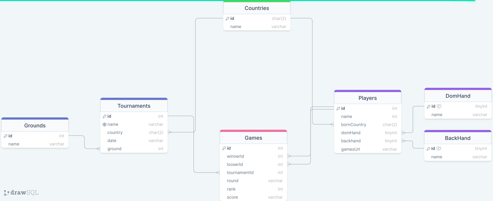

# Introdução
A Associação de Tenistas Profissionais (_ATP_) é um órgão de ténis profisional masculino, organizando torneios do desporto globalmente. A organização contém na sua base de dados um conjunto de jogos e jogadores que participaram em torneios pelo menos desde 1914, e incluem todos os grandes torneios do circuito masculino, incluindo os torneios de Grand Slam. O objetivo deste trabalho será limpar e preparar os dados de um modelo não-relacional para um modelo-relacional, para que possa ser utilizado em análises posteriores.

# Importação dos dados
Para o nosso projeto foi-nos provisionado o ficheiro _atpplayers.json_, que contém os jogos feito pelos jogadores. Para importar este ficheiro, foi utilizado o comando `mongoimport`:
```bash
mongoimport `
    --db atp `
    --collection games `
    --file  ".\data\atpplayers.json"
```
Isto significa que foi criada uma base de dados chamada _atp_, e uma coleção chamada _games_, que contém os dados do ficheiro _atpplayers.json_.

```javascript
use atp;
db.games.find({}, {_id:0}).limit(5);
```
| | | | | | |
| :- | :- | :- | :- | :- | :- |
| **Born** | Belgrade, Serbia | Belgrade, Serbia | Belgrade, Serbia | Belgrade, Serbia | Belgrade, Serbia |
| **Date** | 2022.02.21 - 2022.02.26 | 2021.08.30 - 2021.09.12 | 2021.11.15 - 2021.11.21 | 2021.08.30 - 2021.09.12 | 2021.11.01 - 2021.11.07 |
| **GameRank** | 26 | 145 | 5 | 121 |  |
| **GameRound** | Round of 16 | Round of 128 | Round Robin | Round of 64 | Round of 64 |
| **Ground** | Hard | Hard | Hard | Hard | Hard |
| **Hand** | Right-Handed, Two-Handed Backhand | Right-Handed, Two-Handed Backhand | Right-Handed, Two-Handed Backhand | Right-Handed, Two-Handed Backhand | Right-Handed, Two-Handed Backhand |
| **Height** | 188 | 188 | 188 | 188 | 188 |
| **Location** | Dubai, U.A.E. | New York, NY, U.S.A. | Turin, Italy | New York, NY, U.S.A. | Paris, France |
| **Oponent** | Karen Khachanov | Holger Rune | Andrey Rublev | Tallon Griekspoor | bye |
| **PlayerName** | Novak Djokovic | Novak Djokovic | Novak Djokovic | Novak Djokovic | Novak Djokovic |
| **Prize** | $2,794,840 | $27,200,000 | $7,250,000 | $27,200,000 | �5,207,405 |
| **Score** | 63 76 | 61 67,  62 61 | 63 62 | 62 63 62 | null |
| **Tournament** | Dubai | US Open | Nitto ATP Finals | US Open | ATP Masters 1000 Paris |
| **WL** | W | W | W | W |  |

\scriptsize nota: Foi retirado a coluna LinkPlayer para melhor visualização
\normalsize

A coleção contém 15 colunas:
- PlayerName: Nome do jogador do jogo
- Born: Onde este jogador nasceu (cidade, pais)
- Height: Altura deste jogador (cm)
- Hand: A mão dominante do jogador, e o tipo de _backhand_ que utiliza
- LinkPlayer: link para a página do jogador em atptour.com
- Tournament: nome do torneio do jogo
- Location : A cidade e país onde o torneio foi realizado
- Date: Periodo de tempo do torneio
- GameRound: fase do jogo no torneio
- GameRank: _ATP Rankings_ do jogo
- WL: Vitoria ou Derrota (W ou L)
- Oponent: Nome do Oponente
- Score: Sets do jogo

# Preparar dos dados
Para preparar os dados, nós planeámos transformar a nossa coleção em coleções diferentes, de forma a representar o modelo relacionar, para facilitar a sua transição. Para isso, desenhámos o nosso diagrama do modelo relacional pretendido:



Antes de começar a transformar os dados, foi necessário verificar a integridade deles. 

Primeiro, verificámos se a coluna _Born_ e _Location_ mantinha o formato "cidade, pais" para todos os jogadores. Mais precisamente, como para os nossos propósitos, apenas precisamos do país, verificámos se os países estavam sempre no final da string.
```javascript
db.games.aggregate([
  {
    $match: {
      Born: {$not:/,/}
    }
  },
  {
    $group:{
      _id:"$Born"
    }
  },{
    $sample:{size:5}
  }
]);
```
| \_id |
| :--- |
| Jeju |
| Subiaco |
| Alatri |
| Verona |
| Cordoba |

Perante os resultados, podemos verificar que existem jogadores cujo país não está no final da string. Para resolver este problema, foi-se adicionado manualmente os países destas cidades, de forma a poder analisar o país de origem dos jogadores. O mesmo é observável para a coluna _Location_. Adicionalmente, os países não encontravam consistência; por exemplo, "U.S.A." e "USA" eram usados para representar os Estados Unidos. Logo, foi necessário unificar os países, de forma a que todos os países fossem representados da mesma forma. Para isso, foi criado um ficheiro _countryAlias.csv_, o que associava o código do país com o nome do pais na base de dados. O ficheiro estará disponível no repositório do projeto, e em anexo na submissão.

```csv
alias,country,code
...
U.S.A,USA,US
U.S.A.,USA,US
Ufa,Russia,RU
UK,United Kingdom,GB
Ukraine,Ukraine,UA
United Arab Emirates,United Arab Emirates,AE
Urbino,Italy,IT
URU,Uruguay,UY
Uruguaiana,Brazil,BR
Uruguay,Uruguay,UY
...
```
A partir deste ficheiro, cada pais pode ser associado o seu código usando a _pipeline_ `$lookup` quando for feita a exportação destes dados, depois de importar o ficheiro para a base de dados.

```bash
mongoimport `
    --db atp `
    --collection countryAliases `
    --type csv `
    --headerline `
    --file ".\data\countryAlias.csv"
```
De forma a garantir que todos os países sejam representados no resultado final, ao exportar as coleções, vai ser também importada países não representados na base de dados. O _countryCodes.csv_ pode ser encontrado em [datahub.io/core/country-list](https://pkgstore.datahub.io/core/country-list/data_csv/data/d7c9d7cfb42cb69f4422dec222dbbaa8/data_csv.csv).

```bash
mongoimport `
    --db atp `
    --collection countryCodes `
    --type csv `
    --headerline `
    --file ".\data\countryCodes.csv"
```

Outra verificação que fizemos foi verificar os vários grupos: as colunas _Ground_, _Hand_, e _WL_.

```javascript
db.games.distinct("Ground");
```
| result |
| :--- |
|  |
| Carpet |
| Clay |
| Grass |
| Hard |

```javascript 
db.games.distinct("Hand");
```
| result |
| :--- |
| Ambidextrous, Two-Handed Backhand |
| Left-Handed, One-Handed Backhand |
| Left-Handed, Two-Handed Backhand |
| Left-Handed, Unknown Backhand |
| Right-Handed, One-Handed Backhand |
| Right-Handed, Two-Handed Backhand |
| Right-Handed, Unknown Backhand |
| null |
    
```javascript
db.games.distinct("WL");
```

| result |
| :--- |
|  |
| L |
| W |

Como podemos observar, a coluna _Ground_ e _WL_ têm valores nulos, e a coluna _Hand_ tem valores "null". 
Verificou-se que nestas na primeira e última colunas, a base de dados não contem informação suficiente para verificar poder completar estas colunas, mas não devem interferir com os resultados devido ao pequeno número de casos. Na coluna _WL_, os valores são nulos sem oponentes, ou seja, jogos não jogados. Foi assim decidido não tratar estes casos e filtrar estes ao exportar a coleção.

Ainda assim, decimos separar a _Hand_ em duas colunas, porque vai ser útil para a análise futura.

Por último, observámos casos de torneios com os valores 'TBA', 'TBC', e 'TBD'. Decidimos tornar esses locais como null, de forma a não interferir com os resultados, pois cada um desses valores equivale a 'To be announced', 'To be confirmed', e 'To be determined'.
```javascript
db.games.updateMany(
  {Location: {$in: ["TBA", "TBC", "TBD"]}},
  {$set: {Location: null}}
);
```
# Criação das coleções

Para a nossa criação das coleções, vai ser usada primariamente a função `aggregate` do MongoDB. Esta função permite executar várias _pipelines_ de operações sobre os dados, e é muito útil para a criação de coleções, devido à sua flexibilidade e ao seu desempenho. Em cada uma destas, a _pipeline_ "$out" é usada para exportar os dados da _query_ para uma nova coleção.

## Criação da coleção _Player_

```javascript
db.games.aggregate([
  {
    $group: {
      _id:{
        hand: {$split: ["$Hand", ","]},
        born: {$split: ["$Born", ","]},
        height: "$Height",
        linkPlayer: "$LinkPlayer",
        playerName: "$PlayerName"
      }
    }
  },{
    $project:{
      _id:0,
      playerName: "$_id.playerName",
      country: {$arrayElemAt: ["$_id.born", -1]},
      height: "$_id.height",
      linkPlayer: {$split: ["$_id.linkPlayer", "/"]},
      domHand: {$arrayElemAt: ["$_id.hand", 0]},
      backhand: {$arrayElemAt: ["$_id.hand", 1]}
    }
  },{
    $set: {
      backhand: {$cond: [
        {$eq: ["$backhand", "Unknown Backhand"]}, 
        null, 
        {$trim: {input: "$backhand"}}
      ]},
      domHand: {$cond: [
        {$eq: ["$domHand", "null"]}, 
        null, 
        {$trim: {input: "$domHand"}}
      ]},
      height: {$cond: [{$eq: ["$height", "NA"]}, 0, "$height"]},
      country: {$cond: [{$eq: ["$country", ""]}, null, {$trim: {input: "$country"}}]},
      linkId: {$arrayElemAt: ["$linkPlayer", 6]}
    }
  },{
    $out: "players"
  }
]);
```

Para a criação da coleção _Player_, foi usada a _pipeline_ `$group` para para agrupar os dados de cada jogador, e a pipeline `$project` para tornar os dados mais legíveis e exportáveis. Para o pais do jogador, como o país está sempre no fim da string, ou após uma virgula ou sozinha, foi usada a pipeline `$split` e `$arrayElemAt` para selecionar o último elemento do array. Para a mão dominante e o tipo de backhand, foi usada a mesma técnica, separando a mão dominante da backhand. Por último, foram-se uniformizados os valores nulos e vazios, de forma a estar consistente.

```javascript
db.players.find({}, {_id:0, linkPlayer: 0}).limit(5);
```
| backhand | country | domHand | height | linkId | playerName |
| :--- | :--- | :--- | :--- | :--- | :--- |
| null | null | null | null | f363 | Roberto Fernandez |
| Two-Handed Backhand | Bulgaria | Left-Handed | 183 | l950 | Alexandar Lazov |
| null | null | null | null | k458 | Herve Karcher |
| null | null | null | null | kb56 | Micke Kontinen |
| Two-Handed Backhand | Japan | Right-Handed | 183 | u134 | Yasutaka Uchiyama |


Nota-se que alguns jogadores não têm país, mão dominante, backhand, ou altura registada. Estes casos estão consistentes com a coleção original.

Esta coleção não inclui os oponentes, porque estes vão ser tratados ao exportar os dados, com base na coleção _matches_.

## Criação da coleção _Tournament_

```javascript
db.games.aggregate([
  {
    $group: {
      _id: {
        tournament: "$Tournament",
        location: {$split: ["$Location", ", "]},
        date: "$Date", //TODO tratar
        ground: "$Ground"
      },
      prize: { $first: "$Prize" }
    }
  },{
    $project: {
      _id: 0,
      tournament: "$_id.tournament",
      country: {$arrayElemAt: ["$_id.location", -1]},
      date: "$_id.date",
      ground: {$cond: [{$eq: ["$_id.ground", ""]}, null, "$_id.ground"]},
      prize: "$_id.prize"
    }
  },{
    $out: "tournaments"
  }
]);
```
A coleção _tournaments_ é criada de forma semelhante ao _players_, com um semelhante resultado.

```javascript
db.tournaments.find({}, {_id:0}).limit(5);
```
| country | date | ground | prize | tournament |
| :--- | :--- | :--- | :--- | :--- |
| Scotland | 2000.05.15 - 2000.05.21 | Clay | $25,000 | Edinburgh |
| Croatia | 2013.08.19 - 2013.08.25 | Clay | $10,000 | Croatia F8 |
| England | 1999.09.13 - 1999.09.19 | Clay | $375,000 | Bournemouth |
| Belgium | 1997.07.21 - 1997.07.27 | Clay | $75,000 | Ostend |
| Japan | 2017.09.11 - 2017.09.17 | Hard |  | JPN vs. BRA WG Play-Off |

## Criação da coleção _matches_

```javascript
db.games.aggregate([
  {
    $match: {
      Oponent: {$ne: "bye"}
    }
  },
  {
    $set: {
      winner: {$cond: [{$eq: ["$WL", "W"]}, "$PlayerName", "$Oponent"]},
      loser: {$cond: [{$eq: ["$WL", "W"]}, "$Oponent", "$PlayerName"]},
      winnerLink: {$cond: [
        {$eq: ["$WL", "W"]},
        {$split: ["$LinkPlayer", "/"]},
        null
      ]},
      looserLink: {$cond: [
        {$eq: ["$WL", "W"]},
        null, 
        {$split: ["$LinkPlayer", "/"]}
      ]}
    }
  },
  {
    $group: {
      _id:[
        "$Tournament", 
        "$GameRound", 
        "$Date", 
        "$winner", 
        "$loser", 
        {$arrayElemAt: ["$winnerLink", 6]}, 
        {$arrayElemAt: ["$looserLink", 6]}
      ],
      count: {$sum: 1},
      sets: {$push:"$Score"}
    }
  },{
    $project: {
      _id: false,
      tournament: {$arrayElemAt: ["$_id", 0]},
      gameRound: {$arrayElemAt: ["$_id", 1]},
      date: {$arrayElemAt: ["$_id", 2]},
      winner: {$arrayElemAt: ["$_id", 3]},
      loser: {$arrayElemAt: ["$_id", 4]},
      winnerLinkId: {$arrayElemAt: ["$_id", 5]},
      loserLinkId: {$arrayElemAt: ["$_id", 6]},
      count: true,
      sets: true
    }
  }, {
    $out: "matches"
  }
]);
```
Este processo continua com a semelhança, adicionando a _pipeline_ `$match` para filtrar os jogos sem oponentes, e a _pipeline_ `$set` para criar as colunas _winner_ e _loser_. É adicionado a pipeline `$match` é usada para filtrar os jogos não jogados, e a _pipeline_ `$cond`, o que nos deixa escrever uma condição que decide sobre o vencedor e o perdedor. A _pipeline_ `$sets` garante que os nossos jogos repitidos são realmente repetidos, sendo que um score de, por exemplo, "67 72 25" seria igual a um score de "76 27 52", devido à natureza da coluna; esta vai incluir as varias formas como a coluna se encontra nos vários jogos repetidos.
```javascript
db.matches.find({}, {_id:0}).limit(5);
```
| | | | | | |
| :- | :- | :- | :- | :- | :- |
| **count** | 1 | 1 | 1 | 1 | 1 |
| **date** | 2007.06.18 - 2007.06.24 | 2007.06.18 - 2007.06.24 | 2007.06.18 - 2007.06.24 | 2007.06.18 - 2007.06.24 | 2007.06.18 - 2007.06.24 |
| **gameRound** | 1st Round Qualifying | 1st Round Qualifying | 1st Round Qualifying | 1st Round Qualifying | 1st Round Qualifying |
| **loser** | Sven Swinnen | Sven Swinnen | Xander Spong | Xander Spong | Martijn Van Haasteren |
| **loserLinkId** | sh51 | null | si97 | null | v473 |
| **sets** | \["36 46"\] | \["63 64"\] | \["57 06"\] | \["75 60"\] | \["57 63 26"\] |
| **tournament** | 's-Hertogenbosch | 's-Hertogenbosch | 's-Hertogenbosch | 's-Hertogenbosch | 's-Hertogenbosch |
| **winner** | Alexander Nonnekes | Alexander Nonnekes | Bart Beks | Bart Beks | Gilles Elseneer |
| **winnerLinkId** | null | n425 | null | b547 | null |

Depois deste processo, como um dos linksId está necessariamente vazio devido ao formato original da coleção, vai ser necessário inserir os ids, conforme a coleção _Players_. Esta pesquisa vai ser apenas uma estimativa, devido à genuina falta de informação, mas a diferença não deve implicar os nossos resultados, pois existem poucos jogadores com o mesmo nome.

```javascript
db.matches.aggregate([
  {
    $match: {
      winnerLinkId: null
    }
  },
  {
    $lookup:{
      from: "players",
      localField: "winner",
      foreignField: "playerName",
      as: "winnerInfo"
    }
  },{
    $set:{
      winnerLinkId: {$arrayElemAt: ["$winnerInfo.linkId", 0]}
    }
  },{
    $project: {
      winnerInfo: false
    }
  },{
    $merge: {
      into: "matches",
      on: "_id",
      whenMatched: "replace",
      whenNotMatched: "fail"
    }
  }
]);
db.matches.aggregate([
  {
    $match: {
      loserLinkId: null
    }
  },
  {
    $lookup:{
      from: "players",
      localField: "loser",
      foreignField: "playerName",
      as: "loserInfo"
    }
  },{
    $set:{
      loserLinkId: {$arrayElemAt: ["$loserInfo.linkId", 0]}
    }
  },{
    $project: {
      loserInfo: false
    }
  },{
    $merge: {
      into: "matches",
      on: "_id",
      whenMatched: "replace",
      whenNotMatched: "fail"
    }
  }
]);
```

## Tratamento de colunas individuais

### Países
Até este momento, temos duas (2) coleções que referiam aos paises dos jogadores e dos torneios: _countryAliases_ e _countryCodes_. Vamos juntar estas duas coleções, de forma a incluir códigos de paises não representados na base de dados.

```javascript
db.countryCodes.aggregate([
  {
    $lookup: {
      from: "countryAliases",
      localField: "Code",
      foreignField: "code",
      as: "aliases"
    }
  },
  {
    $match: {
      aliases: {$size: 0}
    }
  },{
    $project:{
      _id: 0,
      alias: "$Name",
      code: "$Code",
      country: "$Name",
    }
  },{
    $unionWith: {
      coll: "countryAliases",
      pipeline: [
        {
          $project: {
            _id: 0,
          }
        }
      ]
    }
  },
  {
    $out: "countryAliases"
  }
]);
```

Com estas duas juntas, vai ser adicionado um campo _countryCode_ a cada documento da coleção _players_ e _tournaments_, com base no campo _country_, com a ajuda da _pipeline_ `$lookup`.

Aqui, a coluna _alias_ é usada para referenciar os países/cidades como estão nas coleções e mudar para o código do país.

Para mudar os paises nas coleções executámos os comandos seguintes:

```javascript
db.players.aggregate([
  {
    $lookup:{
      from: "countryAliases",
      localField: "country",
      foreignField: "alias",
      as: "alias"
    }
   },{
   $set: {
    countryCode: {$arrayElemAt: ["$alias.code", 0]},
    alias: {$arrayElemAt: ["$alias.alias", 0]},
    country: {$arrayElemAt: ["$alias.country", 0]},
   }
  },
  {$out: "players"}
]);
db.players.find({}, {_id:0, linkPlayer: 0}).limit(5);
```
| alias | backhand | country | countryCode | domHand | height | playerName |
| :--- | :--- | :--- | :--- | :--- | :--- | :--- |
| Spain | One-Handed Backhand | Spain | ES | Right-Handed | 183 | David Marrero |
| null | Unknown Backhand | null | null | Right-Handed | null | Zoran Mihailovic |
| null | null | null | null | null | null | Guillaume Dermiens |
| null | Unknown Backhand | null | null | Right-Handed | null | Vince Mackey |
| Germany | One-Handed Backhand | Germany | DE | Right-Handed | 191 | Alex Calatrava |


```javascript
db.tournaments.aggregate([
  {
    $lookup:{
      from: "countryAliases",
      localField: "country",
      foreignField: "alias",
      as: "alias"
    }
   },{
   $set: {
    countryCode: {$arrayElemAt: ["$alias.code", 0]},
    alias: {$arrayElemAt: ["$alias.alias", 0]},
    country: {$arrayElemAt: ["$alias.country", 0]},
   }
  },
  {$out: "tournaments"}
]);
db.tournaments.find({}, {_id:0}).limit(5);
```
| | | | | | |
| :- | :- | :- | :- | :- | :- |
| **alias** | Scotland | Croatia | England | Belgium | Japan |
| **country** | United Kingdom | Croatia | United Kingdom | Belgium | Japan |
| **countryCode** | GB | HR | GB | BE | JP |
| **date** | 2000.05.15 - 2000.05.21 | 2013.08.19 - 2013.08.25 | 1999.09.13 - 1999.09.19 | 1997.07.21 - 1997.07.27 | 2017.09.11 - 2017.09.17 |
| **ground** | Clay | Clay | Clay | Clay | Hard |
| **prize** | $25,000 | $10,000 | $375,000 | $75,000 |  |
| **tournament** | Edinburgh | Croatia F8 | Bournemouth | Ostend | JPN vs. BRA WG Play-Off |


Por último, de forma a transferir os países para o modelo relacional, vamos substituir a coleção _countryCodes_ pelos códigos de países, incluindo aqueles não presentes anteriormente. Como unimos as duas coleções previamente, basta agrupar por código de país e nome.

```javascript
db.countryAliases.aggregate([
  {
    $group:{
      _id: ["$code", "$country"],
      alias: {$push: "$alias"}
    }
    },{
        $project:{
            _id: 0,
            code: {$arrayElemAt: ["$_id", 0]},
            country: {$arrayElemAt: ["$_id", 1]},
            alias: 1
        }
        },{
        $out: "countryCodes"
    }
]);
```
### Players não incluídos
Aqui vai ser adicionado os jogadores não incluídos na coleção original _games_.
```javascript
db.matches.aggregate([
  {
    $lookup:{
      from: "players",
      localField: "winner",
      foreignField: "playerName",
      as: "winnerInfo"
    }
  },{
    $lookup:{
      from: "players",
      localField: "loser",
      foreignField: "playerName",
      as: "loserInfo"
    }
  },{
    $project:{
      _id: 0,
      winner: 1,
      loser: 1,
      countWinner: { $size: "$winnerInfo" },
      countLooser: { $size: "$loserInfo" }
    }
  },{
    $match: {
      $or: [
        {countWinner: 0},
        {countLooser: 0}
      ]
    }
  },{
    $project: {
      player: {$cond: [{$eq: ["$countWinner", 0]}, "$winner", "$loser"]}
    }
  },
  {
    $group: {
      _id: "$player",
      count: {$sum: 1}
    }
  },{
    $out: "missingPlayers"
  }
]);
db.missingPlayers.find().limit(5);
```
| \_id | count |
| :--- | :--- |
| Bertrand Tinck | 5 |
| Mateo Etchevarne | 1 |
| Guillermo Torres Garcia | 1 |
| Marco Linconir | 4 |
| Hai-Yun Tan | 11 |

Esta _query_ primeiro vai verificar os players que estão na coleção _players_ e depois vai agrupar por nome de jogador e contar o número de vezes que não aparece. O resultado é guardado na coleção _missingPlayers_. A seguir, vamos adicionar estes os jogadores à coleção _players_, usando o `$unionWith`.

```javascript
db.missingPlayers.aggregate([
  {
    $project: {
      _id: 0,
      playerName: "$_id",
      linkId: null,
      country: null,
      countryCode: null,
      alias: null
    }
  },
  {
    $unionWith: {
      coll: "players",
      pipeline: [
        {
          $project: {
            _id: 0,
          }
        }
      ]
    },
  },{
    $out: "players"
  }
]);
```

### domHand, backhand e ground
Aqui vamos criar as coleções _domHands_, _backhands_, e _grounds_ de forma a incluí-las mais facilmente no esquema relacional.
```javascript
db.players.aggregate([
  {
    $group: {
      _id: "$domHand"
    }
  },{$match: {_id: {$ne: null}}},{
    $out: "domHands"
  }
]);
db.players.aggregate([
  {
    $group: {
      _id: "$backhand"
    }
  },{$match: {_id: {$ne: null}}},{
    $out: "backhands"
  }
]);
db.tournaments.aggregate([
  {
    $group: {
      _id: "$ground"
    }
  },{$match: {_id: {$ne: null}}},{
    $out: "grounds"
  }
]);
```

# Exportação e importação dos dados

Para exportar os dados, vamos usar o comando `mongoexport` para todas as coleções necessárias.
```bash
mongoexport --db=atp `
  --collection=backhands `
  --type=csv `
  --fields=_id `
  --out=.\data\exports\backhand.csv
mongoexport --db=atp `
  --collection=domHands `
  --type=csv `
  --fields=_id `
  --out=.\data\exports\domhand.csv
mongoexport --db=atp `
  --collection=grounds `
  --type=csv `
  --fields=_id `
  --out=.\data\exports\grounds.csv
mongoexport --db=atp `
  --collection=countryCodes `
  --type=csv `
  --fields=code,country `
  --out=.\data\exports\countries.csv
mongoexport --db=atp `
  --collection=matches `
  --type=csv `
  --fields=sets,winner,winnerLinkId,loser,loserLinkId,tournament,date,gameRound `
  --out .\data\exports\games.csv
mongoexport --db=atp `
  --collection=players `
  --type=csv `
  --fields=countryCode,domHand,backhand,height,playerName,linkId `
  --out .\data\exports\players.csv
mongoexport --db=atp `
  --collection=tournaments `
  --type=csv `
  --fields=countryCode,ground,prize,tournament,date `
  --out .\data\exports\tournaments.csv
```
Para inserir esses csvs na base de dados relacional mysql, vamos usar a declaração `LOAD DATA LOCAL INFILE` do mysql. No entanto, é necessário criar as tabelas e as suas relações previamente, e para isso vai ser usado o diagrama acima como referência.
```sql
drop database if exists aluno_105289_atp;
create database aluno_105289_atp;
use aluno_105289_atp;
CREATE TABLE `Games`(
    `winnerName` VARCHAR(255) NOT NULL,
    `winnerLinkId` CHAR(4) NOT NULL,
    `looserName` VARCHAR(255) NOT NULL,
    `looserLinkId` CHAR(4) NOT NULL,
    `tournamentDate` VARCHAR(255) NOT NULL,
    `tournamentName` VARCHAR(255) NOT NULL,
    `round` VARCHAR(255) NOT NULL,
    `score` VARCHAR(255) NOT NULL,
    primary key 
    (`winnerName`,`winnerLinkId`,`looserName`,`looserLinkId`,`tournamentDate`,`tournamentName`, `round`)
);
CREATE TABLE `Grounds`(`name` VARCHAR(255) NOT NULL primary key );
CREATE TABLE `Tournaments`(
    `name` VARCHAR(255) NOT NULL,
    `date` VARCHAR(255) NOT NULL,
    `countryId` CHAR(2) NULL,
    `ground` VARCHAR(255) NULL,
    `prize` VARCHAR(255) NULL,
    primary key (`name`,`date`)
);
CREATE TABLE `Players`(
    `name` VARCHAR(255) NOT NULL ,
    `linkId` CHAR(4) NOT NULL DEFAULT '0000',
    `bornCountryId` CHAR(2) NULL,
    `domHand` VARCHAR(255) NULL,
    `backhand` VARCHAR(255) NULL,
    `height` INT not null default 0,
    primary key (`name`,`linkId`)
);
CREATE TABLE `DomHand`(`name` VARCHAR(255) NOT NULL);
ALTER TABLE
    `DomHand` ADD PRIMARY KEY `domhand_name_primary`(`name`);
CREATE TABLE `BackHand`(`name` VARCHAR(255) NOT NULL);
ALTER TABLE
    `BackHand` ADD PRIMARY KEY `backhand_name_primary`(`name`);
CREATE TABLE `Countries`(
    `id` CHAR(2) NOT NULL primary key ,
    `name` VARCHAR(255) NOT NULL
);
ALTER TABLE
    `Players` ADD CONSTRAINT 
    `players_backhand_foreign` FOREIGN KEY(`backhand`) 
        REFERENCES `BackHand`(`name`);
ALTER TABLE
    `Players` ADD CONSTRAINT 
    `players_domhand_foreign` 
    FOREIGN KEY(`domHand`) 
        REFERENCES `DomHand`(`name`);
ALTER TABLE
    `Tournaments` ADD CONSTRAINT 
    `tournaments_ground_foreign` 
    FOREIGN KEY(`ground`)
        REFERENCES `Grounds`(`name`);
ALTER TABLE
    `Tournaments` ADD CONSTRAINT 
    `tournaments_countryid_foreign` 
        FOREIGN KEY(`countryId`) REFERENCES `Countries`(`id`);
ALTER TABLE
    `Players` ADD CONSTRAINT 
    `players_borncountryid_foreign` 
        FOREIGN KEY(`bornCountryId`) REFERENCES `Countries`(`id`);
alter table `Games` add constraint 
    `games_winnername_winnerlinkid_foreign` 
    foreign key (`winnerName`,`winnerLinkId`) 
        references `Players`(`name`,`linkId`);
alter table `Games` add constraint 
    `games_loosername_looserlinkid_foreign` 
    foreign key (`looserName`,`looserLinkId`) 
        references `Players`(`name`,`linkId`);
alter table `Games` add constraint 
    `games_tournamentdate_tournamentname_foreign` 
    foreign key (`tournamentName`,`tournamentDate`) 
        references `Tournaments`(`name`,`date`);
```
Agora, vamos importar os dados.
```sql

load data concurrent local infile './data/exports/backhand.csv'
into table backhand
    fields
        terminated by ','
        optionally enclosed by '"'
    ignore 1 lines
(name);
show warnings;
load data concurrent local infile './data/exports/countries.csv'
into table countries
    fields
        terminated by ','
        optionally enclosed by '"'
    ignore 1 lines
(id, name);
show warnings;
load data concurrent local infile './data/exports/domhand.csv'
into table domhand
    fields
        terminated by ','
        optionally enclosed by '"'
    ignore 1 lines
(name);
show warnings;
load data concurrent local infile './data/exports/grounds.csv'
into table grounds
    fields
        terminated by ','
        optionally enclosed by '"'
    ignore 1 lines
(name);
show warnings;

load data concurrent local infile './data/exports/players.csv'
into table players
    fields
        terminated by ','
        optionally enclosed by '"'
    ignore 1 lines
(@vBornCountryId, @vDomHand, @vbackhand, @vHeight, name, @vLinkId)
set
    BornCountryId = NULLIF(@vBornCountryId, ''),
    backhand = NULLIF(@vbackhand, ''),
    domhand = NULLIF(@vDomHand, ''),
    linkId = IF(@vLinkId= '' OR ISNULL(@vLinkId), '0000', @vLinkId),
    height = IF(@vHeight= '' OR ISNULL(@vHeight), 0, @vHeight)
;
show warnings;
load data concurrent local infile './data/exports/tournaments.csv'
into table tournaments
    fields
        terminated by ','
        optionally enclosed by '"'
    ignore 1 lines
(@vCountryId, @vGround, prize, name, date)
set
    Ground = NULLIF(@vGround, ''),
    CountryId = NULLIF(@vCountryId, '');
;
show warnings;

load data concurrent local infile './data/exports/games.csv'
into table games
    fields
        terminated by ','
        optionally enclosed by '"'
    ignore 1 lines
(score, winnerName, @vWinnerLinkId, 
    looserName, @vLooserLinkId, tournamentName, tournamentDate, round)
set
    WinnerLinkId = IF(@vWinnerLinkId= '' OR ISNULL(@vWinnerLinkId), '0000', @vWinnerLinkId),
    LooserLinkId = IF(@vLooserLinkId= '' OR ISNULL(@vLooserLinkId), '0000', @vLooserLinkId);
show warnings;
```
Em cada um destes processos, duas coisas cruciais estão a acontecer: 
- Campos vazios no csv estão a ser substituidos pelos seus valores default
- A cada execução do comando, segue-se um comando _show warnings_, que mostra os erros que ocorreram durante a execução do comando anterior.

Os warnings apresentados são nas tabelas _tournaments_ e _games_ e são devido a alguns valores duplicados da nossa base de dados não limpos antes da passagem para o modelo relacional. A boa formatação do modelo relacional garante que não haverá duplicados na base de dados relacional.

# _Queries_

## 1.

> Para cada país, mostrar número de torneios e de jogos, e o número de jogadores nascidos nesse país.

```sql
select
    c.name as country,
    count(distinct t.name) as tournaments,
    count(distinct g.winnerName, g.winnerLinkId, g.looserName, g.looserLinkId) as games,
    count(distinct p.name, p.linkId) as players
from Countries c
    left join Tournaments t on c.id = t.countryId
    left join Games g on t.name = g.tournamentName and t.date = g.tournamentDate
    left join Players P on P.bornCountryId = c.id
group by
    c.name
order by c.name;
```
| country                 | tournaments | games | players |
|:------------------------|:------------|:------|:--------|
| Afghanistan             | 0           | 0     | 0       |
| Albania                 | 0           | 0     | 0       |
| Algeria                 | 9           | 878   | 3       |
| American Samoa          | 0           | 0     | 0       |
| Andorra                 | 3           | 348   | 0       |
| Angola                  | 0           | 0     | 0       |
| Anguilla                | 0           | 0     | 0       |
| Antarctica              | 0           | 0     | 0       |
| Antigua and Barbuda     | 0           | 0     | 1       |
| Argentina               | 110         | 10341 | 174     |
| ...                     | ...         | ...   | ...     |
| USA                     | 419         | 72774 | 468     |
| Uzbekistan              | 41          | 5613  | 17      |
| Vanuatu                 | 0           | 0     | 0       |
| Venezuela               | 49          | 2650  | 12      |
| Vietnam                 | 15          | 1585  | 2       |
| Virgin Islands, British | 0           | 0     | 0       |
| Virgin Islands, U.S.    | 0           | 0     | 0       |
| Wallis and Futuna       | 0           | 0     | 0       |
| Western Sahara          | 0           | 0     | 0       |
| Yemen                   | 0           | 0     | 0       |
| Yugoslavia              | 29          | 734   | 5       |
| Zambia                  | 0           | 0     | 1       |
| Zimbabwe                | 27          | 610   | 11      |

## 2. 

> Lista o top 10 de jogadores com maior rácio de vitórias (em percentagem), ordenado por esse rácio.

```sql
select p.name, WG.winCount as WinCount, LG.looseCount as LooseCount, WG.winCount*100/(WG.winCount+ LG.looseCount) as winRate from players p
    left join
        (select p.name, P.linkId, count(*) as winCount from players p right join games g on p.name = g.winnerName and p.linkId = g.winnerLinkId group by p.name, p.linkId) WG on WG.name = p.name and WG.linkId = p.linkId
    left join
        (select p.name, P.linkId, count(*) as looseCount from players p right join games g on p.name = g.looserName and p.linkId = g.looserLinkId group by p.name, p.linkId) LG on LG.name = p.name and LG.linkId = p.linkId
order by WG.winCount*100/(WG.winCount+ LG.looseCount) desc limit 10;
```
| name | WinCount | LooseCount | winRate |
| :--- | :--- | :--- | :--- |
| Rocky Royer | 5 | 1 | 83.3333 |
| Rafael Nadal | 1130 | 230 | 83.0882 |
| Novak Djokovic | 1059 | 218 | 82.9287 |
| Bjorn Borg | 659 | 146 | 81.8634 |
| Roger Federer | 1281 | 287 | 81.6964 |
| Ivan Lendl | 1079 | 243 | 81.6188 |
| John McEnroe | 891 | 202 | 81.5188 |
| Jimmy Connors | 1281 | 303 | 80.8712 |
| Reinhart Probst | 4 | 1 | 80.0000 |
| James Tracy | 4 | 1 | 80.0000 |

## 3.

> Lista o top 10 de jogadores esquedirnos com maior rácio de vitórias (em percentagem) dos seus jogos de Grand Slam, ordenado por esse rácio.

Os jogos de Grand Slam são os Australian Open, French Open, Wimbledon e US Open.

```sql
select p.name, WG.winCount as WinCount, LG.looseCount as LooseCount, WG.winCount*100/(WG.winCount+ LG.looseCount) as winRate from players p
    left join
        (select p.name, P.linkId, count(*) as winCount from players p right join games g on p.name = g.winnerName and p.linkId = g.winnerLinkId where g.tournamentName REGEXP 'us open|australian open|roland garros|wimbledon' and p.domHand = 'Left-Handed' group by p.name, p.linkId) WG on WG.name = p.name and WG.linkId = p.linkId
    left join
        (select p.name, P.linkId, count(*) as looseCount from players p right join games g on p.name = g.looserName and p.linkId = g.looserLinkId where g.tournamentName REGEXP 'us open|australian open|roland garros|wimbledon' and p.domHand = 'Left-Handed' group by p.name, p.linkId) LG on LG.name = p.name and LG.linkId = p.linkId
order by WG.winCount*100/(WG.winCount+ LG.looseCount) desc limit 10;
```
| name | WinCount | LooseCount | winRate |
| :--- | :--- | :--- | :--- |
| Rafael Nadal | 299 | 42 | 87.6833 |
| Jimmy Connors | 233 | 50 | 82.3322 |
| John McEnroe | 169 | 39 | 81.2500 |
| Guillermo Vilas | 140 | 45 | 75.6757 |
| Alex Molcan | 8 | 3 | 72.7273 |
| Goran Ivanisevic | 110 | 50 | 68.7500 |
| Thomas Muster | 78 | 38 | 67.2414 |
| Andres Gomez | 62 | 31 | 66.6667 |
| Marcelo Rios | 51 | 26 | 66.2338 |
| Henri Leconte | 81 | 44 | 64.8000 |

## 4. 

> Listar o top 5 de jogadores com o seu número de vitórias em quadra dura

```sql
select g.winnerName, count(*) as wins from games g
    left join players p on g.winnerName = p.name and g.winnerLinkId = p.linkId
    left join tournaments t on g.tournamentName = t.name and g.tournamentDate = t.date
where t.ground = 'Hard'
group by g.winnerName, g.winnerLinkId
order by count(*) desc limit 5;
```
| winnerName | wins |
| :--- | :--- |
| Roger Federer | 801 |
| Novak Djokovic | 658 |
| Ti Chen | 609 |
| Andre Agassi | 608 |
| Yen-Hsun Lu | 562 |
