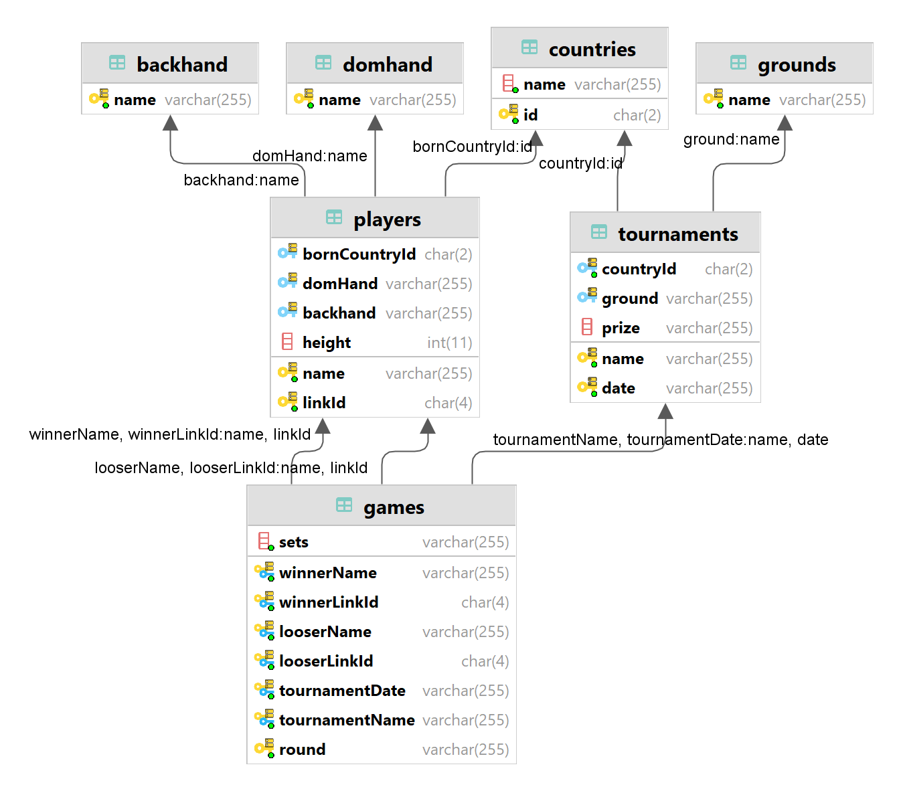

# Introdução
A Associação de Tenistas Profissionais (_ATP_) é um órgão de ténis profisional masculino, organizando torneios do desporto globalmente. A organização contém na sua base de dados um conjunto de jogos e jogadores que participaram em torneios pelo menos desde 1914, e incluem todos os grandes torneios do circuito masculino, incluindo os torneios de Grand Slam. O objetivo deste trabalho será limpar e preparar os dados de um modelo não-relacional para um modelo-relacional, para que possa ser utilizado em análises posteriores.

# Importação dos dados
Para o nosso projeto voi-nos provisionado o ficheiro _atpplayers.json_, que contém os jogos feito pelos jogadores. Para importar este ficheiro, foi utilizado o comando _mongoimport_:
```bash
mongoimport `
    --db atp `
    --collection games `
    --file  "$pwd\data\atpplayers.json"
```
Isto significa que foi criada uma base de dados chamada _atp_, e uma coleção chamada _games_, que contém os dados do ficheiro _atpplayers.json_.

```javascript
use atp;
db.games.find({}, {_id:0}).limit(5);
```
| | | | | | |
| :- | :- | :- | :- | :- | :- |
| **Born** | Belgrade, Serbia | Belgrade, Serbia | Belgrade, Serbia | Belgrade, Serbia | Belgrade, Serbia |
| **Date** | 2022.02.21 - 2022.02.26 | 2021.08.30 - 2021.09.12 | 2021.11.15 - 2021.11.21 | 2021.08.30 - 2021.09.12 | 2021.11.01 - 2021.11.07 |
| **GameRank** | 26 | 145 | 5 | 121 |  |
| **GameRound** | Round of 16 | Round of 128 | Round Robin | Round of 64 | Round of 64 |
| **Ground** | Hard | Hard | Hard | Hard | Hard |
| **Hand** | Right-Handed, Two-Handed Backhand | Right-Handed, Two-Handed Backhand | Right-Handed, Two-Handed Backhand | Right-Handed, Two-Handed Backhand | Right-Handed, Two-Handed Backhand |
| **Height** | 188 | 188 | 188 | 188 | 188 |
| **Location** | Dubai, U.A.E. | New York, NY, U.S.A. | Turin, Italy | New York, NY, U.S.A. | Paris, France |
| **Oponent** | Karen Khachanov | Holger Rune | Andrey Rublev | Tallon Griekspoor | bye |
| **PlayerName** | Novak Djokovic | Novak Djokovic | Novak Djokovic | Novak Djokovic | Novak Djokovic |
| **Prize** | $2,794,840 | $27,200,000 | $7,250,000 | $27,200,000 | �5,207,405 |
| **Score** | 63 76 | 61 67,  62 61 | 63 62 | 62 63 62 | null |
| **Tournament** | Dubai | US Open | Nitto ATP Finals | US Open | ATP Masters 1000 Paris |
| **WL** | W | W | W | W |  |

\scriptsize nota: Foi retirado a coluna LinkPlayer para melhor visualização
\normalsize

A coleção contém 15 colunas:
* PlayerName: Nome do jogador do jogo
* Born: Onde este jogador nasceu (cidade, pais)
* Height: Altura deste jogador (cm)
* Hand: A mão dominante do jogador, e o tipo de _backhand_ que utiliza
* LinkPlayer: link para a página do jogador em atptour.com
* Tournament: nome do torneio do jogo
* Location : A cidade e país onde o torneio foi realizado
* Date: Periodo de tempo do torneio
* GameRound: fase do jogo no torneio
* GameRank: _ATP Rankings_ do jogo
* WL: Vitoria ou Derrota (W ou L)
* Opponent: Nome do Oponente
* Score: Sets do jogo

# Preparar dos dados
Para preparar os dados, nós planeámos transformar a nossa coleção em coleções diferentes, de forma a representar o modelo relacionar, para facilitar a sua transição. Para isso, desenhámos o nosso diagrama do modelo relacional pretendido:



Antes de começar a transformar os dados, foi necessário verificar a integridade deles. 

Primeiro, verificámos se a coluna _Born_ e _Location_ mantinha o formato "cidade, pais" para todos os jogadores. Mais precisamente, como para os nóssos propósitos, apenas precisamos do país, verificámos se os países estavam sempre no final da string.
```javascript
db.games.aggregate([
  {
    $match: {
      Born: {$not:/,/}
    }
  },
  {
    $group:{
      _id:"$Born"
    }
  },{
    $sample:{size:10}
  }
]);
```
| \_id |
| :--- |
| Jeju |
| Subiaco |
| Alatri |
| Verona |
| Cordoba |
| Calgary |
| Santa Monica |
| Wiesbaden |
| La Paz |
| Donetsk |

Perante os resultados, podemos verificar que existem jogadores cujo país não está no final da string. Para resolver este problema, foi-se adicionado manualmente os países destas cidades, de forma a poder analisar o pais de origem dos jogadores. O mesmo é observável para a coluna _Location_. Adicionalmente, os países não encontravam consistência; por exemplo, "U.S.A." e "USA" eram usados para representar os Estados Unidos. Para resolver este problema, mudámos manualmente os países para o formato "alpha2", de acordo com o [ISO 3166-1](https://en.wikipedia.org/wiki/ISO_3166-1).